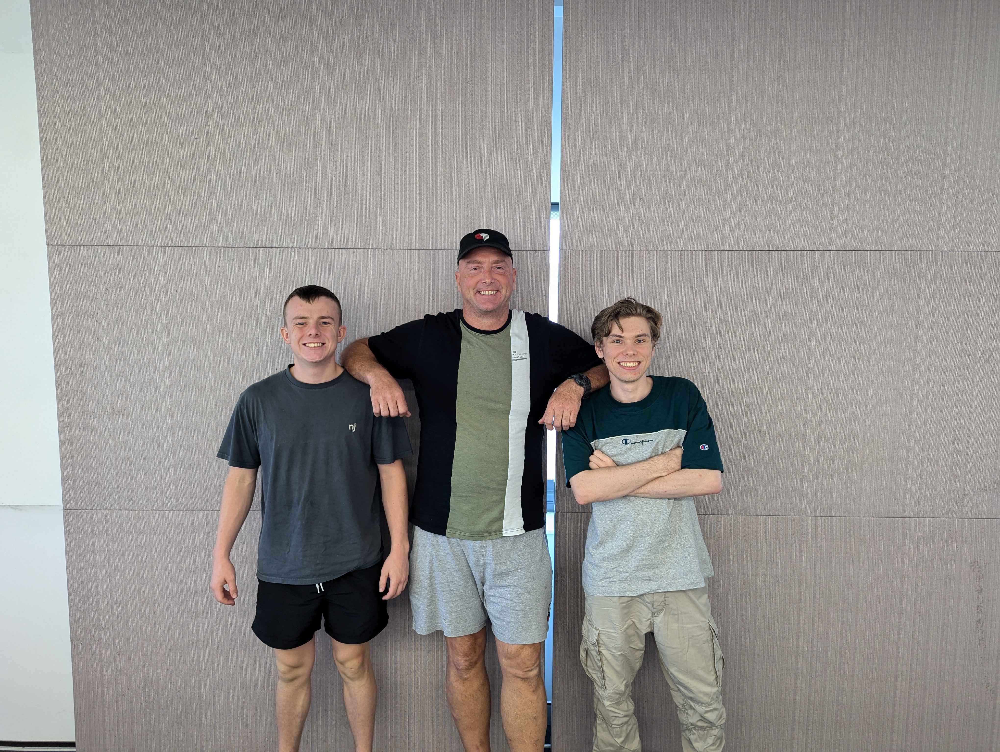
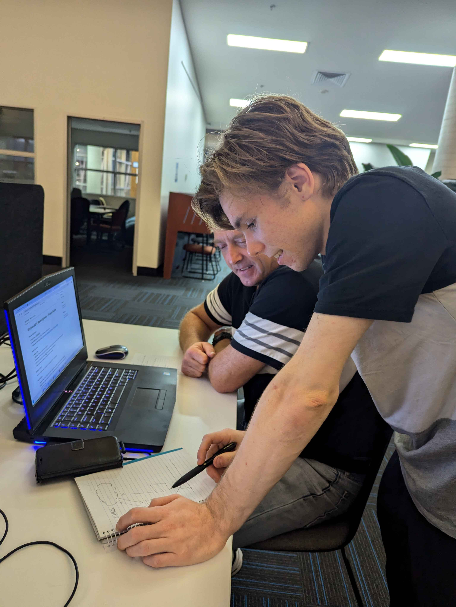
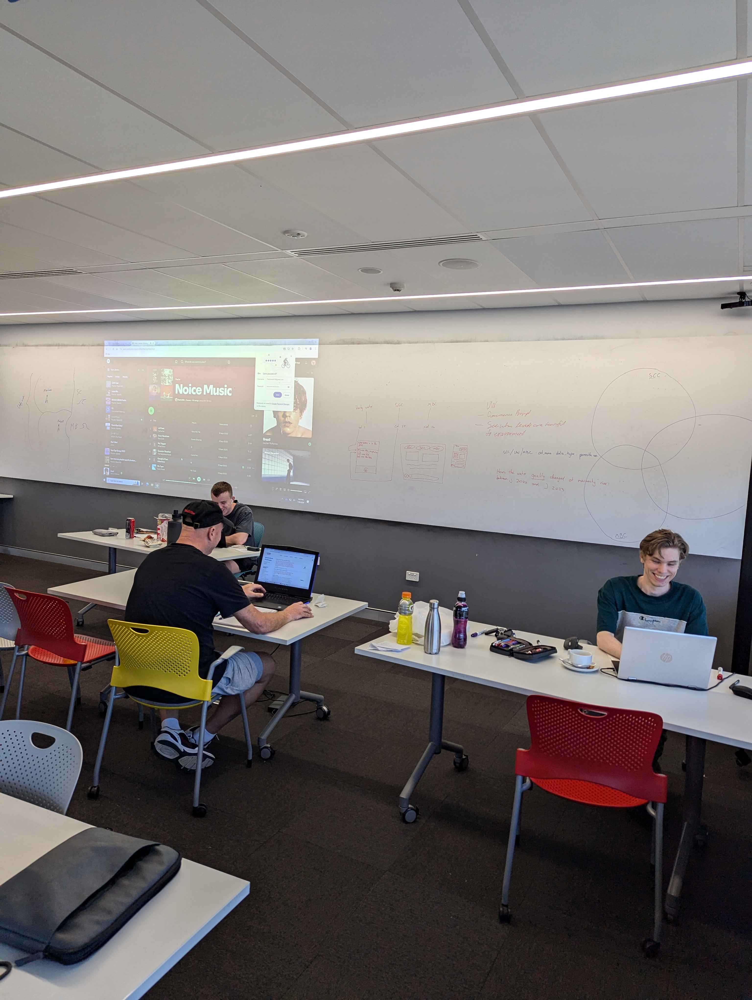

# About Us
We are all students of the Sunshine Coast University based out of the Sunshine Coast campus. Our group was formed out of the mutual love for competition, so that we can learn from each other and have fun while creating something that we can be proud of. 

## Meet the Team

### Jett May
#### Background
1st Year Computer Science Student
#### Role
Makeshift UI

### Rodger Christensen

#### Background
1st Year Computer Science Student
#### Role
allrounder + movie maker

### Quintan Turner

#### Background
3rd Year Computer Science Student
#### Role
The know-it-all

# GovHack
On the first night of Govhack we began brainstorming ideas and getting to know the systems that we will use. Rodger and Jett had never learnt how to use Github so Quintan explained it to them. This was just the start of Quintan's role as the know-it-all (team leader).

Here we are rying to get rolling with a few of the ideas that we had come up with. 

